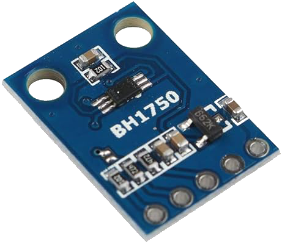

<!-- Improved compatibility of back to top link: See: https://github.com/GiovanniBaccichet/powermonitor/pull/73 -->
<a name="readme-top"></a>
<!--
*** Thanks for checking out the powermonitor. If you have a suggestion
*** that would make this better, please fork the repo and create a pull request
*** or simply open an issue with the tag "enhancement".
*** Don't forget to give the project a star!
*** Thanks again! Now go create something AMAZING! :D
-->


<!-- PROJECT LOGO -->
<br />
<div align="center">
  <a href="https://github.com/GiovanniBaccichet/powermonitor">
    
  </a>

  <h3 align="center">Smart Power Monitor</h3>

  <p align="center">
    A cheap and easy solution to make your electricity meter smarter
    <br />
    <br />
    <a href="https://baccichet.org">Author</a>
    ·
    <a href="https://github.com/GiovanniBaccichet/powermonitor/issues">Report Bug</a>
    ·
    <a href="https://github.com/GiovanniBaccichet/powermonitor/issues">Request Feature</a>
  </p>
</div>


<!-- ABOUT THE PROJECT -->
## About The Project

There are many great README templates available on GitHub; however, I didn't find one that really suited my needs so I created this enhanced one. I want to create a README template so amazing that it'll be the last one you ever need -- I think this is it.

[Electricity Meter Interface 2](https://frient.com/products/electricity-meter-interface-2-led/) electronic meters with LED indicating power consumption


[Integrating your electricity grid](https://www.home-assistant.io/docs/energy/electricity-grid/#reading-the-meter-via-a-pulse-counter) reading the meter via pulse counter

<br>

<div align="center">

</div>

<br>


Here's why:
* Your time should be focused on creating something amazing. A project that solves a problem and helps others
* You shouldn't be doing the same tasks over and over like creating a README from scratch
* You should implement DRY principles to the rest of your life :smile:

Of course, no one template will serve all projects since your needs may be different. So I'll be adding more in the near future. You may also suggest changes by forking this repo and creating a pull request or opening an issue. Thanks to all the people have contributed to expanding this template!

<br>

<div align="center">

</div>

<br>

Use the `BLANK_README.md` to get started.

<p align="right">(<a href="#readme-top">back to top</a>)</p>


<!-- GETTING STARTED -->
## Getting Started

This is an example of how you may give instructions on setting up your project locally.
To get a local copy up and running follow these simple example steps.

### Prerequisites

This is an example of how to list things you need to use the software and how to install them.
* npm
  ```sh
  npm install npm@latest -g
  ```

<br>

<div align="center">

</div>

<br>

### Assembly

Looking at the BH1750 pinout, and reading its data sheet, we need 4 connections.

<br>

<div align="center">

</div>

<br>

On the Raspberry Pi side, the GPIO header is well documented on their website. In particular we are interested in the I2C interface

| **GPIO** | **BH1750** |
| -------- | ---------- |
| 1        | `VCC`      |
| 3        | `SDA`      |
| 5        | `SCL`      |
| 9        | `GND`      |


Please **make your own considerations and read data sheets for the hardware you are using**. I am not responsible for any damages misconfigurations can cause to your hardware.


<p align="right">(<a href="#readme-top">back to top</a>)</p>


<!-- HOME ASSISTANT -->
## Home Assistant

In order to pass the data to Home Assistant, we are using an [MQTT Sensor](https://www.home-assistant.io/integrations/sensor.mqtt/), which is well documented on the project website. My configuration in `configuration.yaml` is the following.

```yaml
mqtt:
  sensor:
    - name: "Power Meter"
      device_class: "energy"
      state_class: "total_increasing"
      state_topic: "homeassistant/sensor/powermonitor/state"
      unit_of_measurement: "Wh"
      unique_id: "powermonitor"
```

Please notice that `state_topic` must match with the MQTT topic we defined 

<p align="right">(<a href="#readme-top">back to top</a>)</p>


<!-- CONTRIBUTING -->
## Contributing

Contributions are what make the open source community such an amazing place to learn, inspire, and create. Any contributions you make are **greatly appreciated**.

If you have a suggestion that would make this better, please fork the repo and create a pull request. You can also simply open an issue with the tag "enhancement".
Don't forget to give the project a star! Thanks again!

1. Fork the Project
2. Create your Feature Branch (`git checkout -b feature/AmazingFeature`)
3. Commit your Changes (`git commit -m 'Add some AmazingFeature'`)
4. Push to the Branch (`git push origin feature/AmazingFeature`)
5. Open a Pull Request

<p align="right">(<a href="#readme-top">back to top</a>)</p>


<!-- LICENSE -->
## License

Distributed under the `GPLv3` License. See `LICENSE` for more information.

<p align="right">(<a href="#readme-top">back to top</a>)</p>


<!-- CONTACT -->
## Contact

Giovanni Baccichet - [@Giovanni_Bacci](https://twitter.com/Giovanni_Bacci) - `github [at] surname [dot] org`

Project Link: [https://github.com/GiovanniBaccichet/powermonitor](https://github.com/GiovanniBaccichet/powermonitor)

<p align="right">(<a href="#readme-top">back to top</a>)</p>


<!-- ACKNOWLEDGMENTS -->
## Acknowledgments

Some useful resources and documentation I used for the project.

* [Power Monitoring with a Raspberry Pi Pico](https://blog.lidskialf.net/2023/12/30/power-monitoring-with-a-raspberry-pi-pico/)
* [BH1750 – Ambient Light Sensor](https://components101.com/sensors/bh1750-ambient-light-sensor)
* [BH1750 Data Sheet](https://www.mouser.com/datasheet/2/348/bh1750fvi-e-186247.pdf)
* [GPIO and the 40-pin Header](https://www.raspberrypi.com/documentation/computers/raspberry-pi.html)
* [Gehäuse für ESP32- und ESP8266-Boards, Raspberry Pi zero, Raspberry Pi pico, ESP32-CAM, diverse Sensoren und Displays](https://www.thingiverse.com/thing:4738646)

<p align="right">(<a href="#readme-top">back to top</a>)</p>
